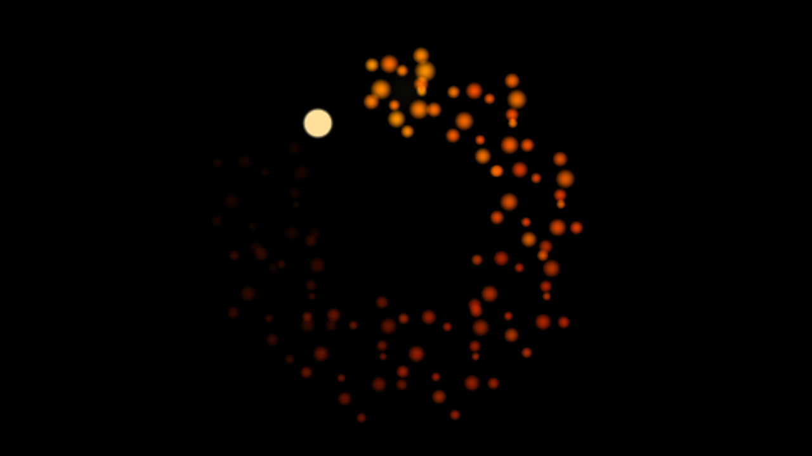

# Flipbook

> **AI-assisted project.** This codebase was created with [Claude](https://claude.com/claude-code)
> (Anthropic), directed and reviewed by a human author. The playback is verified
> numerically by an offline harness that drives the real plugin class in a
> headless GL context: it identifies the cell actually on screen and checks it
> against an independent prediction across all three play modes, measures every
> copy against where the solver said it would land, and asserts that no cell
> bleeds into its neighbour under either filter (see [Status](#status)). It has
> **never been loaded into Resolume or Resolve** — only compiled, rendered and
> measured offline. Check it in your own rig before trusting it in a show.

A sprite sheet player for [Resolume](https://resolume.com) Arena and Avenue, as
a pair of FFGL plugins — and the same thing again as an OpenFX plugin for
Resolve, Nuke, Natron and Vegas. Point it at a page of stills, tell it the grid,
and it plays the cells as an animation.



<sub>Nine copies on a ring with a one-frame stagger, so the burst travels round
the circle and cools as it goes. The sheet is `docs/example-sheet.png`, which
ships with the repo; rendered by `fbtest`, the offline harness.</sub>

**Try it in your browser, with your own sprite sheet:**
[flipbook.stoatworks-labs.com](https://flipbook.stoatworks-labs.com) — the
plugin's own playback and placement in WebGL2. Nothing is uploaded.

**Video:** [What it does, in 50 seconds](https://www.youtube.com/watch?v=k6OB4enGnMo)

<!-- downloads:start -->

## Download

**[v1.0.2](https://github.com/stoatworks-labs/flipbook/releases/tag/v1.0.2)** — prebuilt for macOS and Windows. Pick your platform:

<details>
<summary><b>macOS</b> — Universal (Apple Silicon + Intel)</summary>

| Build | Download | Size |
| --- | --- | --- |
| Universal (Apple Silicon + Intel) · .dmg disk image | [`flipbook-1.0.2-macos-universal.dmg`](https://github.com/stoatworks-labs/flipbook/releases/download/v1.0.2/flipbook-1.0.2-macos-universal.dmg) | 1.0 MB |
| Universal (Apple Silicon + Intel) · .zip archive | [`flipbook-macos-universal.zip`](https://github.com/stoatworks-labs/flipbook/releases/latest/download/flipbook-macos-universal.zip) | 659 KB |
| Universal (Apple Silicon + Intel) · .zip archive (OpenFX — Resolve, Vegas, Nuke) | [`flipbook-ofx-macos-universal.zip`](https://github.com/stoatworks-labs/flipbook/releases/latest/download/flipbook-ofx-macos-universal.zip) | 376 KB |

</details>

<details>
<summary><b>Windows</b> — x64</summary>

| Build | Download | Size |
| --- | --- | --- |
| x64 · .exe installer | [`flipbook-1.0.2-windows-x86_64-setup.exe`](https://github.com/stoatworks-labs/flipbook/releases/download/v1.0.2/flipbook-1.0.2-windows-x86_64-setup.exe) | 324 KB |
| x64 · .zip archive | [`flipbook-windows-x86_64.zip`](https://github.com/stoatworks-labs/flipbook/releases/latest/download/flipbook-windows-x86_64.zip) | 370 KB |
| x64 · .zip archive (OpenFX — Resolve, Vegas, Nuke) | [`flipbook-ofx-windows-x86_64.zip`](https://github.com/stoatworks-labs/flipbook/releases/latest/download/flipbook-ofx-windows-x86_64.zip) | 117 KB |

</details>

All builds, checksums and release notes: [github.com/stoatworks-labs/flipbook/releases](https://github.com/stoatworks-labs/flipbook/releases).

macOS builds are signed and notarised and open normally. The Windows builds are unsigned, so SmartScreen warns once.

<!-- downloads:end -->

## What it plays

Anything laid out on a uniform grid, which is most of what exists:

- **VFX sheets** — explosions, muzzle flashes, impacts, smoke. Usually 5×5 or
  8×8, often on white or black rather than with an alpha channel, which is what
  the Luma key is for.
- **Game sprite sheets** — a character's walk, run and idle on separate rows.
  Start Frame and Frame Count pick out one run, so a 4-frame idle and an 8-frame
  run are two parameter sets on the same sheet.
- **Pixel art**, kept as pixel art. Set Sampling to Pixel and a 32 px sprite
  scales to a metre of LED wall with its edges intact.
- **Pages of whole frames** — rendered backdrops, geometric tiles. Fit: Fill
  covers the raster preserving the cell's aspect; Stretch maps one cell onto it
  exactly, which is right when the cells are already the output's shape.
- **Animated GIFs.** The file already knows its own frame count, so it brings its
  own grid and Columns and Rows are ignored.

## Two plugins

| | |
|---|---|
| **Flipbook** | A generator. The sheet over its own background. |
| **Flipbook Over** | An effect. The sheet over the incoming clip — or the incoming clip *as* the sheet. |

FFGL resolves one `plugMain` per binary, so a source and an effect are two
bundles rather than one bundle with two entries. Both ship together.

"Sheet From: Input Clip" is the interesting half of the effect. Point it at a
clip that is itself a sheet and Resolume's own media management does the file
handling: the sheet lives in the composition, moves with it, can be swapped from
the deck, and can be a moving image rather than a still. What you give up is
exactness — the host has already scaled the sheet into the layer's raster by the
time the plugin sees it, so the cell boundaries are only as true as the clip's
transform. Use a file when the grid has to be right.

## Why the loop point never drifts

The frame on screen is a **pure function of the clock**. Nothing is advanced,
there is no counter, and no state is carried between frames.

That matters more here than it sounds. Twelve frames at twelve frames a second
is one second of animation, and if you have cued that against a bar you expect
the loop to land on the bar line every time. A player that advanced a counter
once per rendered frame would instead run at whatever rate Resolume managed that
night — fine in the preview, a quarter of a frame short per bar once the show
gets heavy, and visibly adrift by the end of the track. Closed-form, the loop
point is arithmetic on the host's clock and cannot drift however far the frame
rate falls.

The same property is why `Sync: Beat` and `Sync: Bar` are one line rather than a
second code path, and why the offline harness can render frame 3.25 without
playing the first three.

## Controls

**Sheet** — the file, `Columns` × `Rows`, and which cells to play. `Start Frame`
is the first cell counting left to right then top to bottom from 0; `Frame Count`
is how many, with **0 meaning "to the end of the sheet"**. A run is allowed to
pass the last cell and come round to the first, which is what a sheet whose
animation straddles the last row needs. `Sampling` is Smooth (bilinear) or Pixel
(nearest).

**Playback** — `Rate` in frames per second, or per beat or per bar under those
Sync modes. `Mode` is Loop, Ping-Pong or Once. `Sync: Manual` ignores the clock
entirely and lets `Phase` drive the sequence, which is the mode for keyframing
against an edit. `Reset` restarts the run, which is what `Once` wants.

**Layout** — `Fit` decides what "actual size" means for this sheet: Native keeps
the cell's own proportions on the frame's short edge, Fill Frame covers the
raster and crops, Stretch maps one cell onto the raster exactly. `Scale` then
multiplies whichever it was, so 1.0 always means "the size Fit said".

**Copies** — up to 64, arranged in a Grid, a Ring or a Scatter. `Stagger` offsets
each copy's position in the run by a fixed number of frames, which is what turns
a field of sprites into a chase travelling through them. It is the control worth
finding first.

**Key** — how the background comes off. `Alpha` trusts the file, and is right for
almost every PNG. `Luma` removes what matches the key colour's *brightness*,
which handles the white-backed JPEG sheets that VFX packs ship as. `Colour`
removes what matches the key colour itself, which is what a pixel-art sheet's one
flat backdrop wants. `None` makes the whole cell opaque.

## Trying it

`docs/example-sheet.png` is a 5×4 burst, generated by
`tools/make_example_sheet.py` and under the same licence as the rest of the repo.
Load it, set Columns 5 and Rows 4, and it plays.

## OpenFX — Resolve, Vegas, Nuke, Natron

The same plugin also builds as OpenFX. It is not a reimplementation: the sheet
decoding, the frame selection, the placement and the parameter curves are the
same source files the FFGL build and the harness use, and one bundle carries both
plugins. Only the per-pixel work — the cell fetch, the key, the composite — is
written twice, because the FFGL build does that on the GPU.

Two differences, both deliberate. **Sync offers Free and Manual only**, because
OFX carries no tempo for Beat and Bar to lock to. And there is **no "Sheet From:
Input Clip"** — an OFX host already has a file browser and a media pool, so the
mode has nothing to offer there.

Copy `Flipbook.ofx.bundle` into the standard OpenFX folder and restart the host:

```
macOS    /Library/OFX/Plugins/
Windows  C:\Program Files\Common Files\OFX\Plugins\
```

## Build

```bash
git clone --recursive https://github.com/stoatworks-labs/flipbook
cd flipbook
cmake -B build -DCMAKE_BUILD_TYPE=Release
cmake --build build
cmake --install build      # straight into Resolume's plugin folder
```

Needs CMake 3.15+ and a C++17 compiler. The Resolume FFGL SDK comes in as a
submodule; on Windows, GLEW comes from vcpkg. Image decoding is
[stb_image](https://github.com/nothings/stb) (public domain), vendored.

## Status

**Verified offline, never run in Resolume or Resolve.** `tools/verify.sh` builds
universal, checks each bundle with `lipo` and `nm`, then renders real frames and
measures them:

| Check | What it proves |
|---|---|
| `fbtest --frames` | the cell on screen matched the prediction at 23 sampled times × 5 configurations, across Loop, Ping-Pong, Once and a run that wraps off the end of the sheet |
| `fbtest --copies` | every copy of 9, 8, 16 and 25 landed where the solver said, showing the frame the stagger said, in all three arrangements |
| `fbtest --aspect` | a square cell stays square to within 2%, and the right size to within 3 px, at 1:1, 16:9, portrait and 2.56:1 |
| `fbtest --seam` | no pixel of three interior cells carries any of a neighbouring cell's colour, under both filters |
| `fbtest --key` | the four key modes do four different things, checked in pairs so "removes everything" cannot pass |
| `tools/sweep.py` | all 39 parameters change the picture — no dead controls |

The OFX build is smoke-tested through `ofxprobe`: both plugins describe, and the
filter renders a known cell to the exact expected colour.

What that does **not** cover, and needs the host: how the parameter groups land
in Resolume's inspector, whether `Beat` and `Bar` lock against a real transport,
whether Resolume renders the integer parameters as typed spinners rather than
0..1 sliders, and how usable "Sheet From: Input Clip" is once a real clip
transform is in the way.

## Diagnostics

A sheet that would not load looks, from the outside, exactly like a plugin that
does nothing. If that happens, the log says which file, and why:

    ~/Library/Logs/flipbook/flipbook.YYYY-MM-DD.log

It also records when the grid does not divide the sheet exactly, which is the
usual reason a sprite plays with a sliver of its neighbour down one edge.

<!-- attributions:start -->
This project is built on other people's work — see [ATTRIBUTIONS.md](ATTRIBUTIONS.md).
<!-- attributions:end -->

## Licence

MIT — see [LICENSE](LICENSE).

Image decoding is [stb_image](https://github.com/nothings/stb) by Sean Barrett,
public domain. The FFGL SDK is Resolume's; the OpenFX SDK subset under
`external/openfx` is BSD-3.
